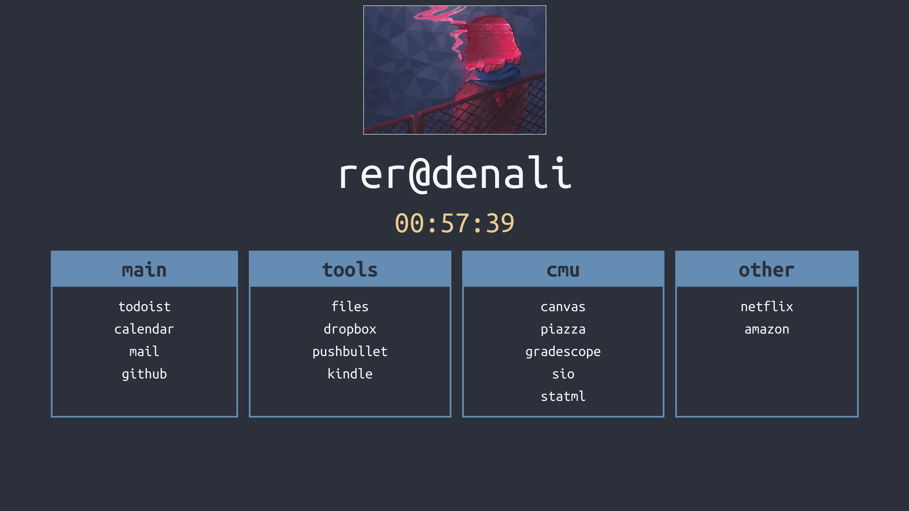
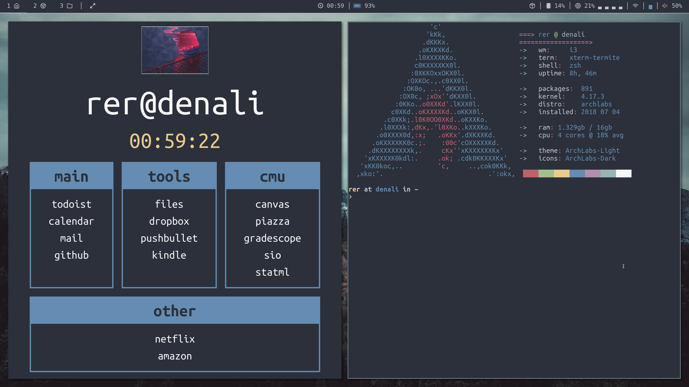

# rer's start page

Check it out [here](http://reroche.github.io/startpage).
And while you're here check out my [personal website](http://reroche.github.io).

I created this start page to make my computer's theme look more integrated. I built it using React. It's still a work in progress. I will be adding a customized search bar to it. 

My computer runs on the excellent [ArchLabs](http://archlabslinux.com). Since it doesn't use a desktop environment (only [i3-gaps](http://https://github.com/Airblader/i3)), I created a home page for my browser so that my software looks more deliberately themed.

The font is _Ubuntu Mono_. The bar on top is [Polybar](https://github.com/jaagr/polybar/). The gif is something I found in [r/glitchart](https://www.reddit.com/r/glitch_art/comments/60u5q0/smoking_girl/) that caught my eye. 
